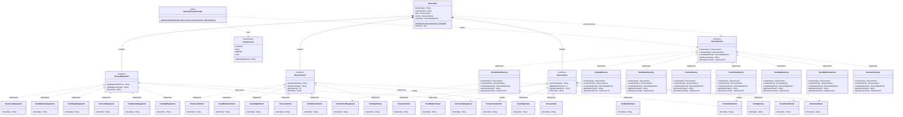

# Abstract Factory Pattern — SOS Rescue System

```mermaid
classDiagram
    direction TB

    %% ═══════════════════════════════════════════════
    %%  ABSTRACT FACTORY
    %% ═══════════════════════════════════════════════
    class RescueFactory {
        <<interface>>
        +createTeam() RescueTeam
        +createVehicle() RescueVehicle
        +createEquipment() RescueEquipment
        +getDisasterType() String
        +getUrgencyLevel() UrgencyLevel
    }

    %% ═══════════════════════════════════════════════
    %%  ABSTRACT PRODUCTS
    %% ═══════════════════════════════════════════════
    class RescueTeam {
        <<interface>>
        +getTeamName() String
        +getMemberCount() int
        +getSpecialization() String
        +describe() String
    }

    class RescueVehicle {
        <<interface>>
        +getVehicleName() String
        +getVehicleType() String
        +getCapacity() int
        +describe() String
    }

    class RescueEquipment {
        <<interface>>
        +getEquipmentName() String
        +getEquipmentType() String
        +describe() String
    }

    %% ═══════════════════════════════════════════════
    %%  CONCRETE FACTORIES — FIRE (Hỏa Hoạn)
    %% ═══════════════════════════════════════════════
    class FireCriticalFactory {
        +createTeam() RescueTeam
        +createVehicle() RescueVehicle
        +createEquipment() RescueEquipment
        +getDisasterType() String
        +getUrgencyLevel() UrgencyLevel
    }

    class FireHighFactory {
        +createTeam() RescueTeam
        +createVehicle() RescueVehicle
        +createEquipment() RescueEquipment
        +getDisasterType() String
        +getUrgencyLevel() UrgencyLevel
    }

    class FireMediumFactory {
        +createTeam() RescueTeam
        +createVehicle() RescueVehicle
        +createEquipment() RescueEquipment
        +getDisasterType() String
        +getUrgencyLevel() UrgencyLevel
    }

    class FireLowFactory {
        +createTeam() RescueTeam
        +createVehicle() RescueVehicle
        +createEquipment() RescueEquipment
        +getDisasterType() String
        +getUrgencyLevel() UrgencyLevel
    }

    %% ═══════════════════════════════════════════════
    %%  CONCRETE FACTORIES — FLOOD (Lũ Lụt)
    %% ═══════════════════════════════════════════════
    class FloodCriticalFactory {
        +createTeam() RescueTeam
        +createVehicle() RescueVehicle
        +createEquipment() RescueEquipment
        +getDisasterType() String
        +getUrgencyLevel() UrgencyLevel
    }

    class FloodHighFactory {
        +createTeam() RescueTeam
        +createVehicle() RescueVehicle
        +createEquipment() RescueEquipment
        +getDisasterType() String
        +getUrgencyLevel() UrgencyLevel
    }

    class FloodMediumFactory {
        +createTeam() RescueTeam
        +createVehicle() RescueVehicle
        +createEquipment() RescueEquipment
        +getDisasterType() String
        +getUrgencyLevel() UrgencyLevel
    }

    class FloodLowFactory {
        +createTeam() RescueTeam
        +createVehicle() RescueVehicle
        +createEquipment() RescueEquipment
        +getDisasterType() String
        +getUrgencyLevel() UrgencyLevel
    }

    %% ═══════════════════════════════════════════════
    %%  CONCRETE PRODUCTS — FIRE TEAM
    %% ═══════════════════════════════════════════════
    class FireCriticalTeam { +describe() String }
    class FireHighTeam     { +describe() String }
    class FireMediumTeam   { +describe() String }
    class FireLowTeam      { +describe() String }

    %% ═══════════════════════════════════════════════
    %%  CONCRETE PRODUCTS — FIRE VEHICLE
    %% ═══════════════════════════════════════════════
    class FireCriticalVehicle { +describe() String }
    class FireHighVehicle     { +describe() String }
    class FireMediumVehicle   { +describe() String }
    class FireLowVehicle      { +describe() String }

    %% ═══════════════════════════════════════════════
    %%  CONCRETE PRODUCTS — FIRE EQUIPMENT
    %% ═══════════════════════════════════════════════
    class FireCriticalEquipment { +describe() String }
    class FireHighEquipment     { +describe() String }
    class FireMediumEquipment   { +describe() String }
    class FireLowEquipment      { +describe() String }

    %% ═══════════════════════════════════════════════
    %%  CONCRETE PRODUCTS — FLOOD TEAM
    %% ═══════════════════════════════════════════════
    class FloodCriticalTeam { +describe() String }
    class FloodHighTeam     { +describe() String }
    class FloodMediumTeam   { +describe() String }
    class FloodLowTeam      { +describe() String }

    %% ═══════════════════════════════════════════════
    %%  CONCRETE PRODUCTS — FLOOD VEHICLE
    %% ═══════════════════════════════════════════════
    class FloodCriticalVehicle { +describe() String }
    class FloodHighVehicle     { +describe() String }
    class FloodMediumVehicle   { +describe() String }
    class FloodLowVehicle      { +describe() String }

    %% ═══════════════════════════════════════════════
    %%  CONCRETE PRODUCTS — FLOOD EQUIPMENT
    %% ═══════════════════════════════════════════════
    class FloodCriticalEquipment { +describe() String }
    class FloodHighEquipment     { +describe() String }
    class FloodMediumEquipment   { +describe() String }
    class FloodLowEquipment      { +describe() String }

    %% ═══════════════════════════════════════════════
    %%  PROVIDER + CLIENT
    %% ═══════════════════════════════════════════════
    class RescueFactoryProvider {
        <<utility>>
        +getFactory(disasterType String, urgency UrgencyLevel)$ RescueFactory
    }

    class RescueKit {
        -disasterType : String
        -urgencyName  : String
        -team         : RescueTeam
        -vehicle      : RescueVehicle
        -equipment    : RescueEquipment
        +from(factory RescueFactory)$ RescueKit
        +printKit() void
    }

    class UrgencyLevel {
        <<enumeration>>
        CRITICAL
        HIGH
        MEDIUM
        LOW
        +getDisplayName() String
    }

    %% ═══════════════════════════════════════════════
    %%  RELATIONSHIPS — Factory Interface
    %% ═══════════════════════════════════════════════
    RescueFactory <|.. FireCriticalFactory  : implements
    RescueFactory <|.. FireHighFactory      : implements
    RescueFactory <|.. FireMediumFactory    : implements
    RescueFactory <|.. FireLowFactory       : implements
    RescueFactory <|.. FloodCriticalFactory : implements
    RescueFactory <|.. FloodHighFactory     : implements
    RescueFactory <|.. FloodMediumFactory   : implements
    RescueFactory <|.. FloodLowFactory      : implements

    %% ═══════════════════════════════════════════════
    %%  RELATIONSHIPS — Abstract Products
    %% ═══════════════════════════════════════════════
    RescueTeam      <|.. FireCriticalTeam  : implements
    RescueTeam      <|.. FireHighTeam      : implements
    RescueTeam      <|.. FireMediumTeam    : implements
    RescueTeam      <|.. FireLowTeam       : implements
    RescueTeam      <|.. FloodCriticalTeam : implements
    RescueTeam      <|.. FloodHighTeam     : implements
    RescueTeam      <|.. FloodMediumTeam   : implements
    RescueTeam      <|.. FloodLowTeam      : implements

    RescueVehicle   <|.. FireCriticalVehicle  : implements
    RescueVehicle   <|.. FireHighVehicle      : implements
    RescueVehicle   <|.. FireMediumVehicle    : implements
    RescueVehicle   <|.. FireLowVehicle       : implements
    RescueVehicle   <|.. FloodCriticalVehicle : implements
    RescueVehicle   <|.. FloodHighVehicle     : implements
    RescueVehicle   <|.. FloodMediumVehicle   : implements
    RescueVehicle   <|.. FloodLowVehicle      : implements

    RescueEquipment <|.. FireCriticalEquipment  : implements
    RescueEquipment <|.. FireHighEquipment      : implements
    RescueEquipment <|.. FireMediumEquipment    : implements
    RescueEquipment <|.. FireLowEquipment       : implements
    RescueEquipment <|.. FloodCriticalEquipment : implements
    RescueEquipment <|.. FloodHighEquipment     : implements
    RescueEquipment <|.. FloodMediumEquipment   : implements
    RescueEquipment <|.. FloodLowEquipment      : implements

    %% ═══════════════════════════════════════════════
    %%  RELATIONSHIPS — Factory creates Products
    %% ═══════════════════════════════════════════════
    FireCriticalFactory  ..> FireCriticalTeam      : creates
    FireCriticalFactory  ..> FireCriticalVehicle   : creates
    FireCriticalFactory  ..> FireCriticalEquipment : creates

    FloodCriticalFactory ..> FloodCriticalTeam      : creates
    FloodCriticalFactory ..> FloodCriticalVehicle   : creates
    FloodCriticalFactory ..> FloodCriticalEquipment : creates

    %% ═══════════════════════════════════════════════
    %%  RELATIONSHIPS — Provider & Client
    %% ═══════════════════════════════════════════════
    RescueFactoryProvider ..> RescueFactory : returns
    RescueFactoryProvider ..> UrgencyLevel  : uses
    RescueKit             ..> RescueFactory : uses (via from())
    RescueKit             *-- RescueTeam    : contains
    RescueKit             *-- RescueVehicle : contains
    RescueKit             *-- RescueEquipment : contains
```

