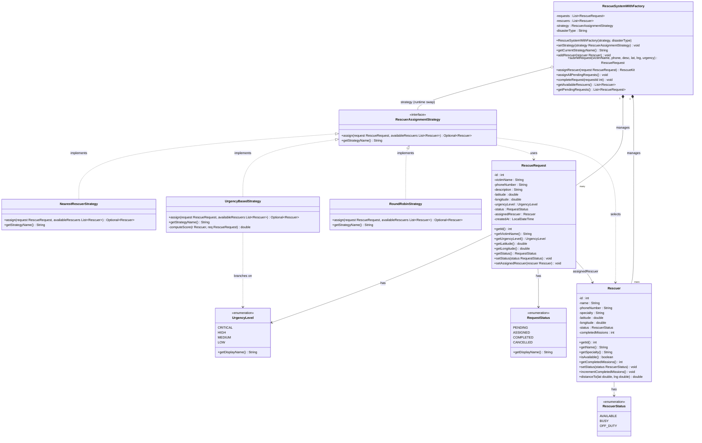

# Strategy Pattern — SOS Rescue System

```mermaid
classDiagram
    direction TB

    %% ═══════════════════════════════════════════════
    %%  STRATEGY INTERFACE
    %% ═══════════════════════════════════════════════
    class RescuerAssignmentStrategy {
        <<interface>>
        +assign(request RescueRequest, availableRescuers List~Rescuer~) Optional~Rescuer~
        +getStrategyName() String
    }

    %% ═══════════════════════════════════════════════
    %%  CONCRETE STRATEGIES
    %% ═══════════════════════════════════════════════
    class NearestRescuerStrategy {
        +assign(request RescueRequest, availableRescuers List~Rescuer~) Optional~Rescuer~
        +getStrategyName() String
    }

    class UrgencyBasedStrategy {
        +assign(request RescueRequest, availableRescuers List~Rescuer~) Optional~Rescuer~
        +getStrategyName() String
        -computeScore(r Rescuer, req RescueRequest) double
    }

    class RoundRobinStrategy {
        +assign(request RescueRequest, availableRescuers List~Rescuer~) Optional~Rescuer~
        +getStrategyName() String
    }

    %% ═══════════════════════════════════════════════
    %%  CONTEXT
    %% ═══════════════════════════════════════════════
    class RescueSystemWithFactory {
        -requests : List~RescueRequest~
        -rescuers : List~Rescuer~
        -strategy : RescuerAssignmentStrategy
        -disasterType : String
        +RescueSystemWithFactory(strategy, disasterType)
        +setStrategy(strategy RescuerAssignmentStrategy) void
        +getCurrentStrategyName() String
        +addRescuer(rescuer Rescuer) void
        +submitRequest(victimName, phone, desc, lat, lng, urgency) RescueRequest
        +assignRescuer(request RescueRequest) RescueKit
        +assignAllPendingRequests() void
        +completeRequest(requestId int) void
        +getAvailableRescuers() List~Rescuer~
        +getPendingRequests() List~RescueRequest~
    }

    %% ═══════════════════════════════════════════════
    %%  MODEL CLASSES
    %% ═══════════════════════════════════════════════
    class RescueRequest {
        -id : int
        -victimName : String
        -phoneNumber : String
        -description : String
        -latitude : double
        -longitude : double
        -urgencyLevel : UrgencyLevel
        -status : RequestStatus
        -assignedRescuer : Rescuer
        -createdAt : LocalDateTime
        +getId() int
        +getVictimName() String
        +getUrgencyLevel() UrgencyLevel
        +getLatitude() double
        +getLongitude() double
        +getStatus() RequestStatus
        +setStatus(status RequestStatus) void
        +setAssignedRescuer(rescuer Rescuer) void
    }

    class Rescuer {
        -id : int
        -name : String
        -phoneNumber : String
        -specialty : String
        -latitude : double
        -longitude : double
        -status : RescuerStatus
        -completedMissions : int
        +getId() int
        +getName() String
        +getSpecialty() String
        +isAvailable() boolean
        +getCompletedMissions() int
        +setStatus(status RescuerStatus) void
        +incrementCompletedMissions() void
        +distanceTo(lat double, lng double) double
    }

    class UrgencyLevel {
        <<enumeration>>
        CRITICAL
        HIGH
        MEDIUM
        LOW
        +getDisplayName() String
    }

    class RequestStatus {
        <<enumeration>>
        PENDING
        ASSIGNED
        COMPLETED
        CANCELLED
        +getDisplayName() String
    }

    class RescuerStatus {
        <<enumeration>>
        AVAILABLE
        BUSY
        OFF_DUTY
    }

    %% ═══════════════════════════════════════════════
    %%  RELATIONSHIPS — Strategy
    %% ═══════════════════════════════════════════════
    RescuerAssignmentStrategy <|.. NearestRescuerStrategy : implements
    RescuerAssignmentStrategy <|.. UrgencyBasedStrategy   : implements
    RescuerAssignmentStrategy <|.. RoundRobinStrategy     : implements

    %% Context holds Strategy (can be swapped at runtime)
    RescueSystemWithFactory o-- RescuerAssignmentStrategy : strategy (runtime swap)

    %% Context manages model objects
    RescueSystemWithFactory "1" *-- "many" RescueRequest : manages
    RescueSystemWithFactory "1" *-- "many" Rescuer        : manages

    %% Strategy uses model objects
    RescuerAssignmentStrategy ..> RescueRequest : uses
    RescuerAssignmentStrategy ..> Rescuer        : selects

    %% Model associations
    RescueRequest --> UrgencyLevel  : has
    RescueRequest --> RequestStatus : has
    RescueRequest --> Rescuer       : assignedRescuer
    Rescuer       --> RescuerStatus : has

    %% Note: UrgencyBasedStrategy branches logic by UrgencyLevel
    UrgencyBasedStrategy ..> UrgencyLevel : branches on
```

