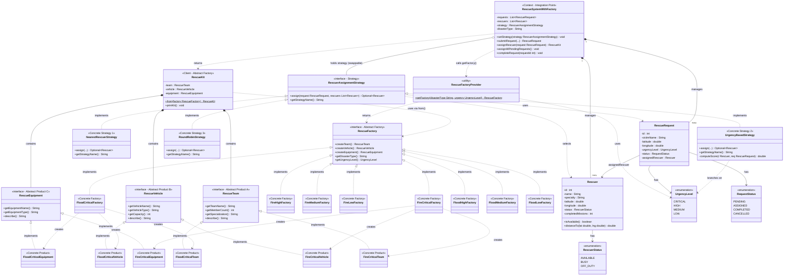

# Combined Patterns — Abstract Factory + Strategy (SOS Rescue System)

```mermaid
classDiagram
    direction TB

    %% ╔══════════════════════════════════════════════════════════╗
    %%  ABSTRACT FACTORY PATTERN (màu xanh)
    %% ╚══════════════════════════════════════════════════════════╝

    class RescueFactory {
        <<interface - Abstract Factory>>
        +createTeam() RescueTeam
        +createVehicle() RescueVehicle
        +createEquipment() RescueEquipment
        +getDisasterType() String
        +getUrgencyLevel() UrgencyLevel
    }

    class RescueTeam {
        <<interface - Abstract Product A>>
        +getTeamName() String
        +getMemberCount() int
        +getSpecialization() String
        +describe() String
    }

    class RescueVehicle {
        <<interface - Abstract Product B>>
        +getVehicleName() String
        +getVehicleType() String
        +getCapacity() int
        +describe() String
    }

    class RescueEquipment {
        <<interface - Abstract Product C>>
        +getEquipmentName() String
        +getEquipmentType() String
        +describe() String
    }

    %% --- Concrete Factories FIRE ---
    class FireCriticalFactory { <<Concrete Factory>> }
    class FireHighFactory     { <<Concrete Factory>> }
    class FireMediumFactory   { <<Concrete Factory>> }
    class FireLowFactory      { <<Concrete Factory>> }

    %% --- Concrete Factories FLOOD ---
    class FloodCriticalFactory { <<Concrete Factory>> }
    class FloodHighFactory     { <<Concrete Factory>> }
    class FloodMediumFactory   { <<Concrete Factory>> }
    class FloodLowFactory      { <<Concrete Factory>> }

    %% --- Concrete Products FIRE ---
    class FireCriticalTeam      { <<Concrete Product>> }
    class FireCriticalVehicle   { <<Concrete Product>> }
    class FireCriticalEquipment { <<Concrete Product>> }

    %% --- Concrete Products FLOOD ---
    class FloodCriticalTeam      { <<Concrete Product>> }
    class FloodCriticalVehicle   { <<Concrete Product>> }
    class FloodCriticalEquipment { <<Concrete Product>> }

    class RescueFactoryProvider {
        <<utility>>
        +getFactory(disasterType String, urgency UrgencyLevel)$ RescueFactory
    }

    class RescueKit {
        <<Client - Abstract Factory>>
        -team : RescueTeam
        -vehicle : RescueVehicle
        -equipment : RescueEquipment
        +from(factory RescueFactory)$ RescueKit
        +printKit() void
    }

    %% ╔══════════════════════════════════════════════════════════╗
    %%  STRATEGY PATTERN (màu cam)
    %% ╚══════════════════════════════════════════════════════════╝

    class RescuerAssignmentStrategy {
        <<interface - Strategy>>
        +assign(request RescueRequest, rescuers List~Rescuer~) Optional~Rescuer~
        +getStrategyName() String
    }

    class NearestRescuerStrategy {
        <<Concrete Strategy 1>>
        +assign(...) Optional~Rescuer~
        +getStrategyName() String
    }

    class UrgencyBasedStrategy {
        <<Concrete Strategy 2>>
        +assign(...) Optional~Rescuer~
        +getStrategyName() String
        -computeScore(r Rescuer, req RescueRequest) double
    }

    class RoundRobinStrategy {
        <<Concrete Strategy 3>>
        +assign(...) Optional~Rescuer~
        +getStrategyName() String
    }

    %% ╔══════════════════════════════════════════════════════════╗
    %%  CONTEXT — Điểm giao nhau của 2 Pattern
    %% ╚══════════════════════════════════════════════════════════╝

    class RescueSystemWithFactory {
        <<Context - Integration Point>>
        -requests : List~RescueRequest~
        -rescuers : List~Rescuer~
        -strategy : RescuerAssignmentStrategy
        -disasterType : String
        +setStrategy(strategy RescuerAssignmentStrategy) void
        +submitRequest(...) RescueRequest
        +assignRescuer(request RescueRequest) RescueKit
        +assignAllPendingRequests() void
        +completeRequest(requestId int) void
    }

    %% ╔══════════════════════════════════════════════════════════╗
    %%  MODEL
    %% ╚══════════════════════════════════════════════════════════╝

    class RescueRequest {
        -id : int
        -victimName : String
        -latitude : double
        -longitude : double
        -urgencyLevel : UrgencyLevel
        -status : RequestStatus
        -assignedRescuer : Rescuer
    }

    class Rescuer {
        -id : int
        -name : String
        -specialty : String
        -latitude : double
        -longitude : double
        -status : RescuerStatus
        -completedMissions : int
        +isAvailable() boolean
        +distanceTo(lat double, lng double) double
    }

    class UrgencyLevel {
        <<enumeration>>
        CRITICAL
        HIGH
        MEDIUM
        LOW
    }

    class RequestStatus {
        <<enumeration>>
        PENDING
        ASSIGNED
        COMPLETED
        CANCELLED
    }

    class RescuerStatus {
        <<enumeration>>
        AVAILABLE
        BUSY
        OFF_DUTY
    }

    %% ═══════════════════════════════════════════════
    %%  ABSTRACT FACTORY — relationships
    %% ═══════════════════════════════════════════════
    RescueFactory <|.. FireCriticalFactory   : implements
    RescueFactory <|.. FireHighFactory       : implements
    RescueFactory <|.. FireMediumFactory     : implements
    RescueFactory <|.. FireLowFactory        : implements
    RescueFactory <|.. FloodCriticalFactory  : implements
    RescueFactory <|.. FloodHighFactory      : implements
    RescueFactory <|.. FloodMediumFactory    : implements
    RescueFactory <|.. FloodLowFactory       : implements

    RescueTeam      <|.. FireCriticalTeam       : implements
    RescueTeam      <|.. FloodCriticalTeam      : implements
    RescueVehicle   <|.. FireCriticalVehicle    : implements
    RescueVehicle   <|.. FloodCriticalVehicle   : implements
    RescueEquipment <|.. FireCriticalEquipment  : implements
    RescueEquipment <|.. FloodCriticalEquipment : implements

    FireCriticalFactory  ..> FireCriticalTeam       : creates
    FireCriticalFactory  ..> FireCriticalVehicle    : creates
    FireCriticalFactory  ..> FireCriticalEquipment  : creates
    FloodCriticalFactory ..> FloodCriticalTeam      : creates
    FloodCriticalFactory ..> FloodCriticalVehicle   : creates
    FloodCriticalFactory ..> FloodCriticalEquipment : creates

    RescueFactoryProvider ..> RescueFactory : returns
    RescueFactoryProvider ..> UrgencyLevel  : uses

    RescueKit ..> RescueFactory   : uses via from()
    RescueKit *-- RescueTeam      : contains
    RescueKit *-- RescueVehicle   : contains
    RescueKit *-- RescueEquipment : contains

    %% ═══════════════════════════════════════════════
    %%  STRATEGY — relationships
    %% ═══════════════════════════════════════════════
    RescuerAssignmentStrategy <|.. NearestRescuerStrategy : implements
    RescuerAssignmentStrategy <|.. UrgencyBasedStrategy   : implements
    RescuerAssignmentStrategy <|.. RoundRobinStrategy     : implements

    RescueSystemWithFactory o-- RescuerAssignmentStrategy : holds strategy (swappable)
    RescuerAssignmentStrategy ..> RescueRequest : uses
    RescuerAssignmentStrategy ..> Rescuer        : selects

    %% ═══════════════════════════════════════════════
    %%  INTEGRATION POINT — Context dùng cả 2 pattern
    %% ═══════════════════════════════════════════════
    RescueSystemWithFactory "1" *-- "many" RescueRequest : manages
    RescueSystemWithFactory "1" *-- "many" Rescuer        : manages
    RescueSystemWithFactory ..> RescueFactoryProvider : calls getFactory()
    RescueSystemWithFactory ..> RescueKit             : returns

    %% ═══════════════════════════════════════════════
    %%  MODEL — relationships
    %% ═══════════════════════════════════════════════
    RescueRequest --> UrgencyLevel   : has
    RescueRequest --> RequestStatus  : has
    RescueRequest --> Rescuer        : assignedRescuer
    Rescuer       --> RescuerStatus  : has
    UrgencyBasedStrategy ..> UrgencyLevel : branches on
```

